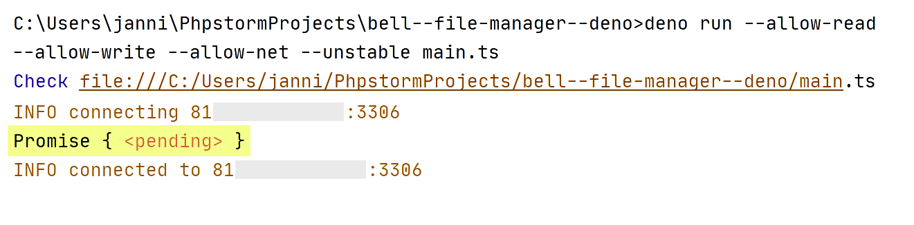
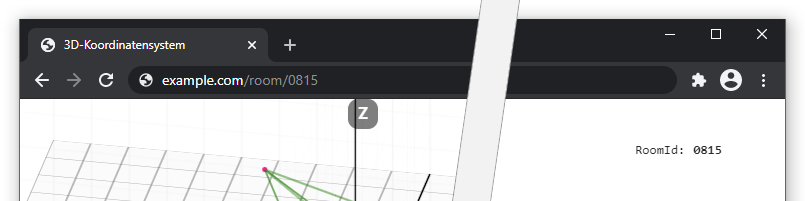
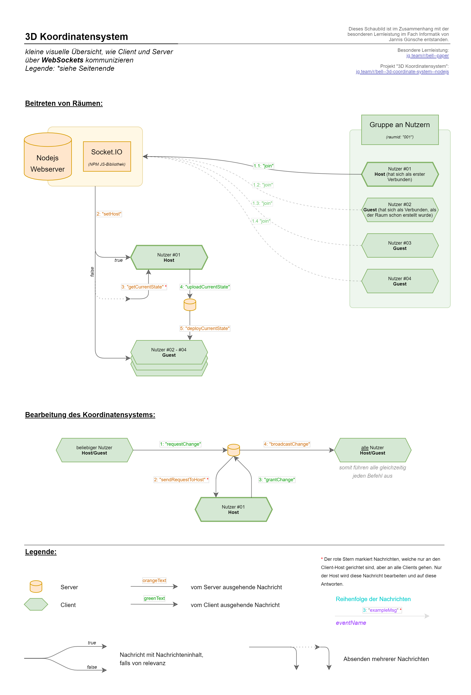
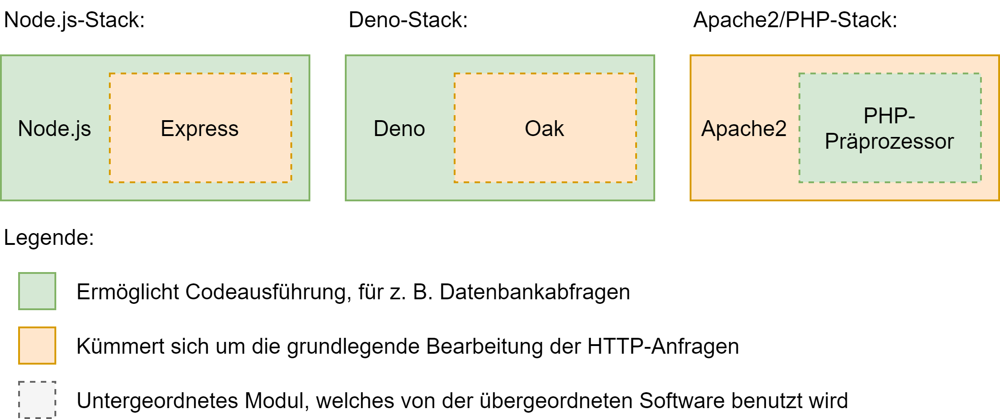
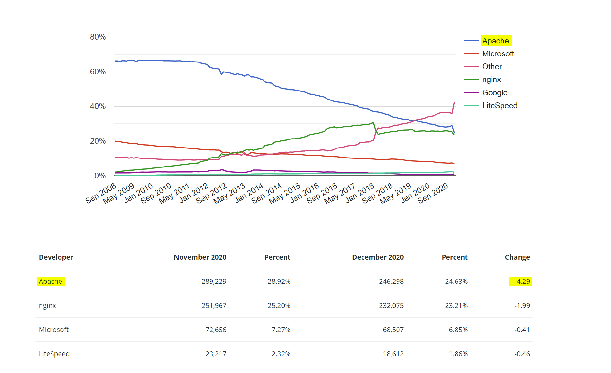
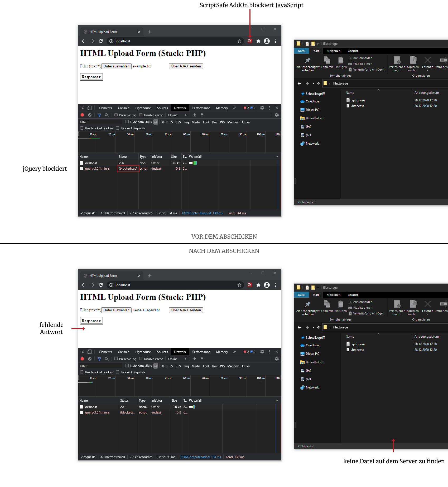
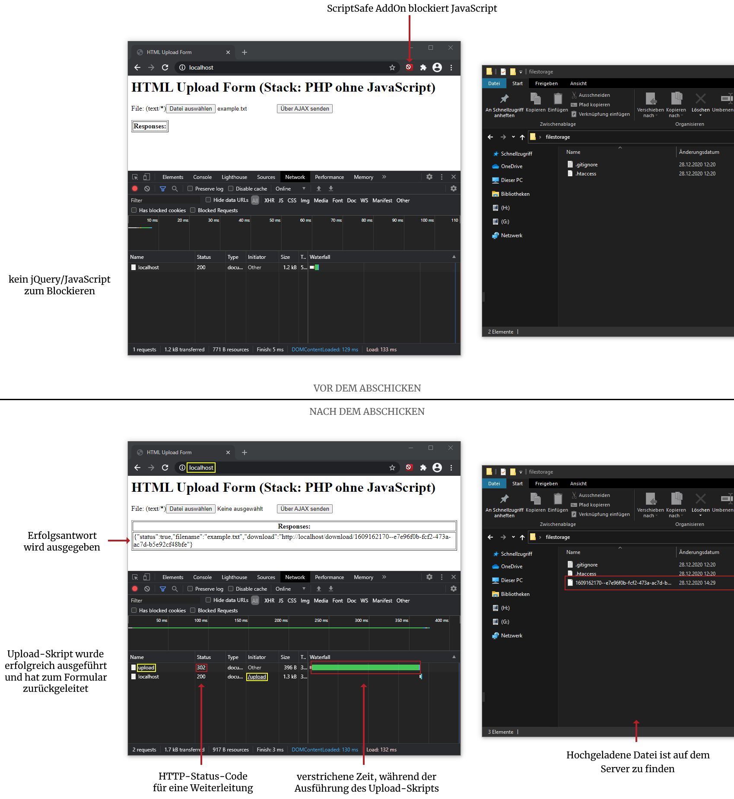
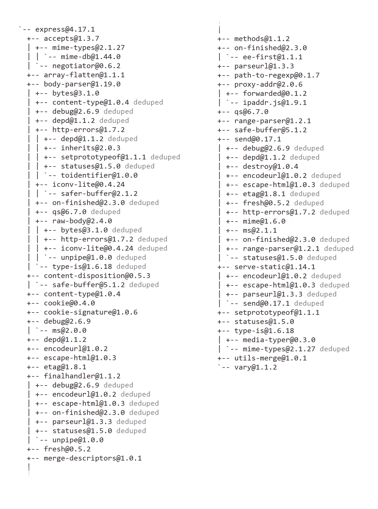
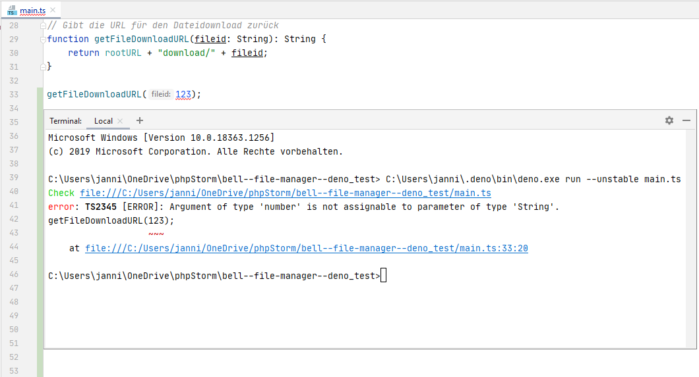

**Abbildung I:** Projekt File-Manager (Deno-Stack): Ausgaben in der Konsole, während die Funktion getFilePath(fileid) ohne await in console.log() aufgerufen wird.

---

**Abbildung II:** Projekt 3D-Koordinatensystem: Raum-Seite "Room 0815" und Adressleiste mit leicht lesbarer URL

---

**Abbildung III:** Projekt 3D Koordinatensystem: Ausschnitt der Kommunikation über WebSockets

---

**Abbildung IV:** Stark vereinfachter Aufbau der Softwarestacks

---

**Abbildung V:** *Web server developers: Market share of the top million busiest sites* \[net20]

---

**Abbildung VI:** Projekt File-Manager (PHP-Stack mit JavaScript): Vor und nach dem Absenden des Formulars, mit aktiviertem JavaScript-Blocker

---

**Abbildung VII:** Projekt File-Manager (PHP-Stack ohne JavaScript): Vor und nach dem Absenden des Formulars, mit aktiviertem JavaScript-Blocker

---

**Abbildung VIII:** Auflistung aller Abhängigkeiten von dem *Express*-Package

---

**Abbildung IX:** Projekt File-Manager (Deno-Stack): TypeScript Datentyp Error

